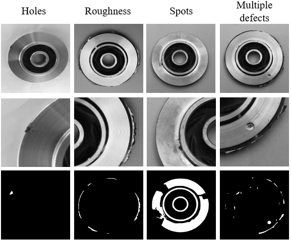

# Casting impeller dataset

해당 데이터셋은 주조 공정에서 제조되는 impeller 데이터를 바탕으로, pixel-precise ground truth labels 구축한 데이터셋이다.

이 데이터셋을 활용하여, impeller에 대한 pixel-level anomaly detection의 정량적 평가가 가능하다.



원본 데이터셋 : <https://www.kaggle.com/datasets/ravirajsinh45/real-life-industrial-dataset-of-casting-product>
## Dataset
1. 다양한 조명 및 각도에서 촬영한 정상데이터들을 train과 test 단계의 normal data로 선정
2. Impeller에서 발생하는 다양한 유형의 결함들을 파악하고 이를 test 단계의 anomaly data로 선정
3. anomaly data에서 존재하는 결함들을 pixel 단위로 라벨링하여 ground truth 구축

제공하는 dataset의 구성은 다음과 같다.
```shell
casting dataset_with_pixel_precise_ground_truth_labels
|-- train
|-----|----- good
|-----|--------|------ cast_ok_0_35.jpeg
|-----|--------|------ ...
|-- test
|-----|----- good
|-----|--------|------ cast_ok_0_199.jpeg
|-----|--------|------ ...
|-----|----- anomaly
|-----|--------|------ cast_def_0_7998.jpeg
|-----|--------|------ ...
|-- ground_truth
|-----|----- anomaly
|-----|--------|------ cast_def_0_7998_mask.png
|-----|--------|------ ...
```
